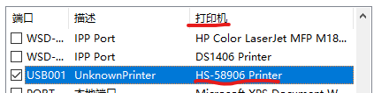
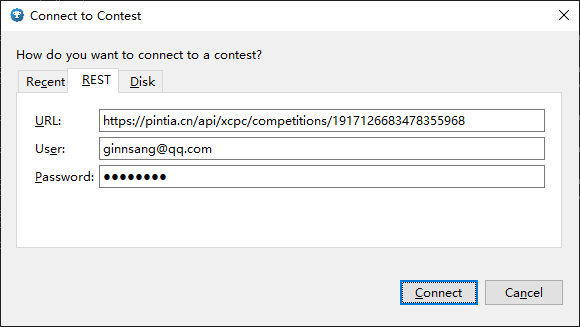
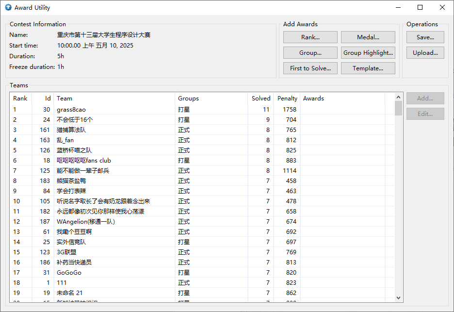
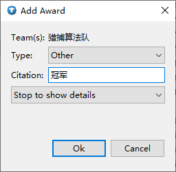

# Read Me

刚办完重庆市赛，用的pta的系统。研究了一下小票打印、代码打印和滚榜功能的实现，应葛老师请求写一下（我研究出的）使用说明。

## 打印

小票打印和代码打印功能都使用pta提供的XCPCPrinter软件实现。

其实[pta给的说明书](./attachments/百腾教育XCPC配套气球打印系统使用说明.pdf)够详细了，感觉做点补充即可。注意，以下只是补充，步骤在pta给的说明书里。

- 安装普通打印机。
    这步都不会的不建议继续阅读。
    大部分打印机会自动安装驱动，如果连上了但是用不了可以查查是不是需要手动安装驱动。
    请记住打印机的名字。安装完成后可以在**设置-设备/蓝牙和其他设备-打印机和扫描仪**下找到它们，也可以给它们改点好听的名字，在打印机属性里可以打印测试页。顺带一提，网络打印机是在这里添加安装。
- 安装票据打印机
    小票打印机需要手动安装驱动，安装程序在pta提供的压缩包里。记得去打印机属性里设置端口，一般来说是看打印机那列叫HS-58906 Printer的端口，有可能端口那列不叫usb叫com。
    
- 运行软件
    竞赛ID问pta要。长得和题目集ID（oms软件进入比赛后地址栏里那个）很像，注意区分。
    登录的账号需要有比赛监听权限。权限问pta要。
    代码打印机在左边设置，小票打印机在右边设置。代码打印机在左边设置，小票打印机在右边设置。代码打印机在左边设置，小票打印机在右边设置。
    选对打印机名字，之前要求记就是这里用。有人在左边选了小票机的名字以后问我怎么打印出错了，我说你想拿小票机打A4纸怎么不出错，他说他连的是打印机没连小票机。哦对，安装过驱动以后电脑会记住对应的打印机，即使物理上断开了连接，在XCPCPrinter里也是可以选的。所以请记住每个打印机的名字。
    可以使用多台电脑连接多台打印机同时处理打印任务。记得配队伍过滤，测试过不开队伍过滤会导致重复打印。小票机应该只有一台，如果使用多台电脑的话，连小票机的电脑就不能处理代码打印任务了，你不能给它配队伍过滤。
    **请关注程序内的log，确保log一直在刷新**，因为监听有可能卡住。卡住了就重新点一下右上角的开始监听。重新开始监听时打印会自动停止，也需要重新开启。程序最底下一行有运行状态信息，确保打印状态是运行中。
    log里有气球小票的信息。如果送气球的志愿者的小票掉了可以看这个检查。

暂时就想起来这些。

## 滚榜

滚榜功能使用ICPC TOOLS Resolver实现。这是icpc官方的滚榜工具，pta会给，也可以自己网上下载。

之前以为pta不提供滚榜服务，去GitHub上找了个project，整挺好，有兴趣可以给他点点star。如果你们买的服务里没有滚榜，可以鼓捣一下这个。https://github.com/LaoBuZhang/HBCPC-resolver

这次我们买的pta服务内包含滚榜，我就不写上面这个的研究了。
双击awards.bat/sh(windows/linux)启动awards，选择REST，按照[pta提供的说明书](./attachments/滚榜测试竞赛.pdf)填入对应信息点击connect即可。请确认填入的user拥有比赛监听权限，权限问pta要。

↑这不是我的邮箱。请不要向该邮箱发送邮件。

等它读取完成后应该是这个界面。

右上角Add Awards选项都是给定条件自动分配奖项。Rank是前多少名，Medal是金银铜奖（但是每项最多分10个队，正常规模的比赛都用不了），Group是所有组别的前多少名，Group Highlight和Group功能一样不过可以单独对某组别设置，First to Solve是最快解题。Template是前面这些的json版整合，但是名字和参数都得靠猜，不太好用。前面五项与自己冲突，进行新设置会覆盖上一次的设置。这五项互不冲突，分别设置不会影响彼此。Template与所有选项冲突（毕竟是它们的整合）。软件会提示冲突。
除了Group和Group Highlight，其他选项都**不会**自动排除打星队，至少我没有研究出自动排除的办法。因此建议使用Group Highlight标记最佳女队、最佳打星队、正式队冠军（亚军和季军标不了，它同一个Award Type下的Citation是一样的，split没用，会只剩两个，要么干脆冠军也手动加），使用First to Solve标记最快解题奖，剩下的手动添加。手动添加是在下面选Team点右边Add，Type就选Other（原因刚提过了，还是同一个Award Type的问题）然后Citation里写奖项名。Other类型可以随便加多少个，互不冲突。加完可以选择Team进行Edit，修改奖项的Citation。
加奖项时默认的Action是Stop to show details，滚榜时会跳转队伍照片界面，Citation就是这个页面左下角显示的文字。有兴趣可以试试别的Action，我没去试。


奖项添加完后点右上角Save导出json文件，等下resolver要用。

resolver的用法在说明书里也有，resolver所在目录启动命令行，输入命令`resolver.bat fileName.json --display_name “{team.name}({org.name})”`启动。(fileName.json: awards生成的json文件)
启动失败有可能是java虚拟机内存不足，把resolver.bat里最后一行的`-Xmx1024m`改成`-Xmx4g`试试。

**关于校徽和队伍照片：**
上面那个命令是不带图片的，运行resolver后校徽位置是空的，队伍照片是默认照片，一个巨大icpc图标。
resolver支持cdp目录结构，添加照片的方法如下：
```
resolver
└─cdp                        // 文件夹名应该是任意的
    │  event-feed.json       // award生成的json，似乎必须叫这个
    │
    ├─organizations          // 校徽存这里
    │  └─1                   // 对应学校的organization id，一个学校建一个文件夹就好了
    │          logo.png      // 可以是其他图片格式，没测试叫其他的名字行不行
    │
    └─teams                  // 队伍照片存这里
        └─1                  // 对应队伍的team id
                photo.png
```
上面运行resolver的命令里`fileName.json`改成`./cdp/`即可。
team id在awards界面可以看到（第二列），但是organization id要在event-feed.json里找。先找到这个学校某个队伍的team id，再在event-feed.json里找到对应team id的行，行内那个organization id是学校的id。非常麻烦。更恶心的是awards不完全支持中文，汉字是utf编码，在awards界面显示还好，但是按队名排序并不能按照拼音排序，导出的json里的队名也是utf编码，没法搜索，只能用team id去对应。我没有研究出更好的办法。也许pta后台其实有这俩东西，但是我忘问了。
还有签到时给队伍拍照要记得记录队伍名。不然就得赛时去位置上一个个拍赛场英姿了。

resolver的快捷键（命令行输入`resolver.bat --help`）：
```
Keyboard shortcuts:
     Ctrl-Q - Quit
     r      - Rewind
     0      - Restart (jump to beginning)
     2      - Fast forward (jump one step without delays)
     1      - Fast rewind (jump one step back without delays)
     +/up   - Speed up (reduce resolution delay)
     -/down - Slow down (increase resolution delay)
     j      - Reset resolution speed
     p      - Pause/unpause scrolling
     i      - Toggle additional info
```
鼠标左键/空格/F都可以下一步。上面有些介绍语焉不详，建议都尝试一遍看看效果。

大概就这些？

## 参考博客
https://blog.csdn.net/xzx18822942899/article/details/128275137
https://vingying.github.io/2024/09/04/domjudge-icpctool/